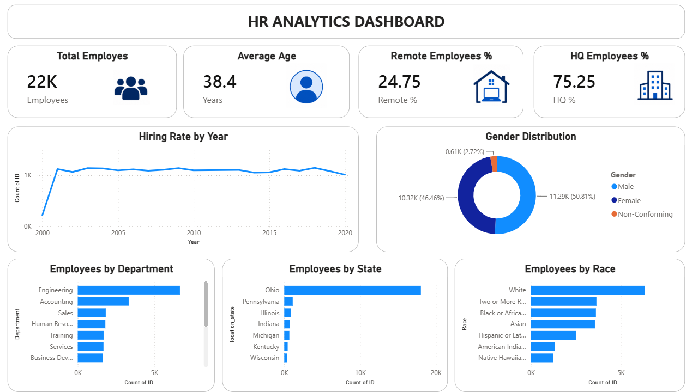

# HR Analytics Dashboard 📊

## Project Overview
An interactive HR Analytics Dashboard built using Power BI to analyze employee demographics, hiring trends, workforce distribution, and diversity metrics.

## Tools Used
- Power BI (Dashboard & Visualizations)
- MySQL (Data Source)
- Microsoft Excel (Dataset)

## Dataset
- Total Records: 22,214 employees
- Key Columns: Employee ID, Age, Gender, Race, Department, Job Title, Location, Hire Date, State

## Dashboard Features
- KPI Cards: Total Employees, Average Age, Remote % and HQ %
- Line Chart: Hiring Rate by Year
- Donut Chart: Gender Distribution
- Bar Charts: Employees by Department, State, and Race

## Key Insights
- Highest hiring was in 2018 with 1,147 new hires
- 75.25% employees work from HQ, 24.75% work remotely
- Engineering is the largest department
- Ohio has the highest employee concentration
- Male employees represent 50.81% of the workforce

## Dashboard Preview

## Presented By
**N Lokesh** 
